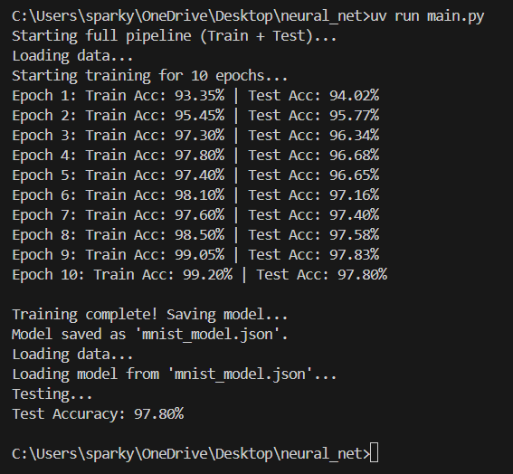

# Neural Network from scratch

MNIST handwritten digits dataset recognition using neural network from scratch.

## Result 

## Model Architecture

- Input layer: 784 neurons (28x28 pixels)
- Hidden layer: 128 neurons
- Output layer: 10 neurons (digits 0-9)

## Training

- Epochs: 10
- Batch size: 32
- Learning rate: 0.01

## Usage

- Run `python main.py` to train and test the model.
- Run `python main.py --test` to only run the test set on the saved `mnist_model.json`.

## Accuracy

- Training accuracy: 99.20%
- Test accuracy: 97.80%
